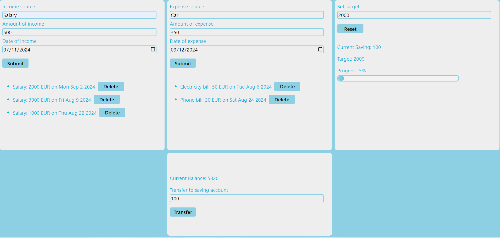

# Budgetify React App

Welcome to the **Budgetify React App** repository! This project is a personal finance management application built using React and TypeScript. The application is designed to help users manage their incomes, expenses, savings, and set financial goals efficiently. Below are the requirements and features implemented in this application.



## Project Overview

Budgetify is a one-page application that allows users to track their financial activities including incomes, expenses, and savings. It provides a clear and concise summary of the user's financial status, helping them achieve their savings goals.

## Features

### Level 1: Basic Requirements

- **UI Development**: The application is built as a single-page application using React, with a clean and intuitive interface for managing finances.
- **Income Management**: Users can add multiple income sources with values and dates.
- **Expense Management**: Users can add multiple expense entries with values and dates.
- **Saving Target and Amount**: Users can set a target saving amount and track their current savings.
- **Summary Display**: The app displays a summary section showing:
  - Total Income
  - Total Expenses
  - Target Saving Amount
  - Current Saving Amount
- **Styling**: The components are styled using CSS modules, styled-components, or any preferred styling method.
- **Deployment**: The app is deployed on [Netlify](#) / [Vercel](#) and accessible through the provided link.

### Level 2: Additional Requirements

- **Balance Calculation**: The app calculates the account balance using the formula:
- **Saving Transfer**: Users can transfer the balance amount directly to their savings.
- **Saving Progress**: The app calculates the total of the current savings and displays the percentage of current savings relative to the target saving amount.
- **Data Management**: Users can delete income and expense entries.
- **Input Validation**: Input fields for income, expenses, and savings are validated to ensure they are positive numbers. Validation is implemented using React Hook Form and Zod. If a negative number is entered, an error message is displayed.
- **Data Persistence**: Data is stored in local storage to ensure it persists across page refreshes.

### Level 3: Bonus Requirements

- **Routing**: The app uses React Router to manage navigation. When users access `/budget-app`, the Budget component is rendered.
- **Data Visualization**: A chart is implemented to visualize incomes and expenses using a library like `react-chartjs-2` or `recharts`.
- **Data Export**: Users can export their income and expense data to a CSV file for external use.

## Getting Started

### Prerequisites

Ensure you have the following installed:

- Node.js
- npm or yarn
- TypeScript

### Installation

1. Clone the repository:

```bash
git clone https://github.com/your-username/budgetify-react.git
```

2. Clone the repository:

```bash
 cd budget-react
```

3. Install dependencies:

```bash
 npm install
```

### Running the App

1. Start the development server:

```bash
  npm run dev
```

2. Clone the repository:

```bash
 cd budget-react
```

### Deployment

The app is deployed on Netlify. You can access the live version [here](https://nachawati-budget-app.netlify.app/)
.
